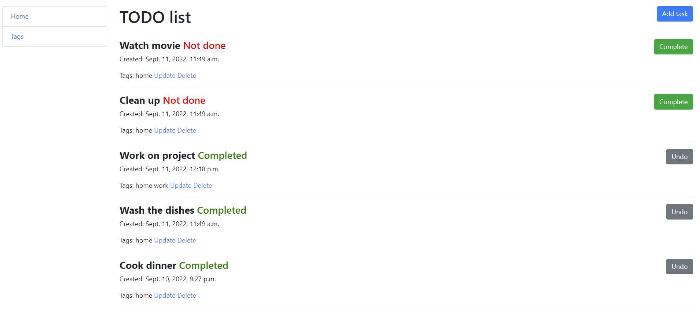
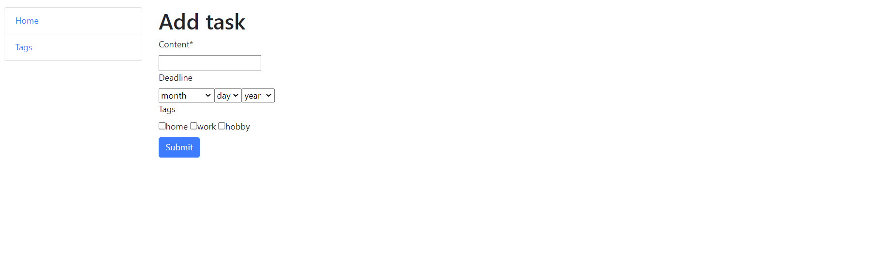

# To Do List Project

Django project for managing everyday tasks

## Features

* Managing everyday tasks directly from website interface
* Optional setting of deadlines for better productivity
* Possibility of adding task tags to clarify which life area the task belongs to 

## Demo

